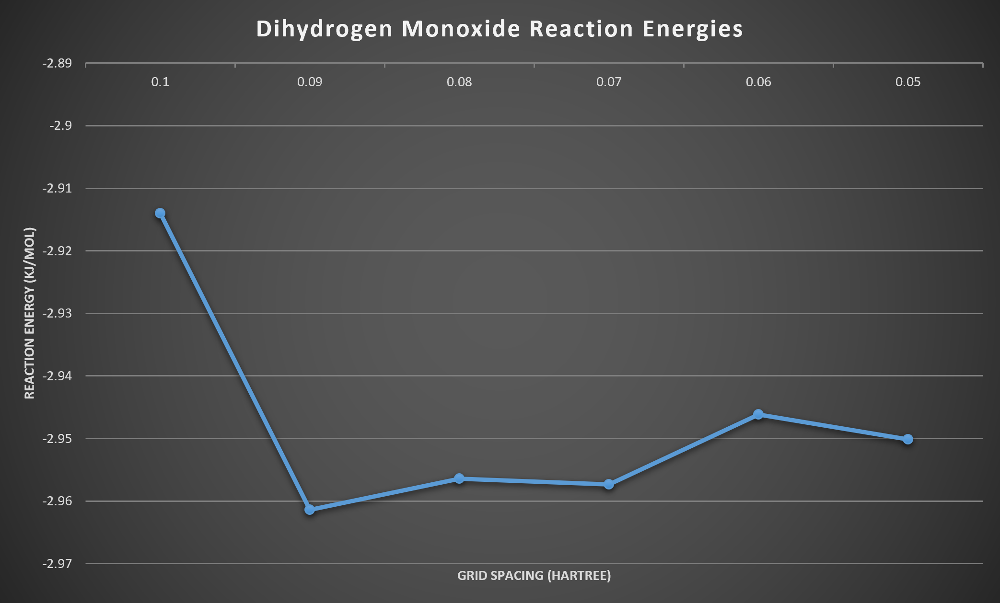

# DFTSimulation

## Author
Sravan Jayanthi

## Density Functional Theory Simulation
The simulation is designed to study the quantum mechanical phenomenon of atomic interactions and the forces experienced within multi-body system. Density Functional Theory relies on electronic configurations being in the most optimal geometry such that atom centered basis sets represent a relaxed state of the atom. Then the model calculates minimal adaptive basis sets to represent polarized atomic orbitals. The Schrödinger equation is used to generate the potentials for each entity in the simulation and multiple iterations of functional calculations occur before the model reaches low tolerance levels. The final potential energy of the system is determined and this can be used to calculate the reaction energy of the iteraction. The calculations can be performed with different calculators that provide alternate scopes and parameters that can be manipulated to refine the output. 

## Description
This project contains the three scripts, outputted csv, reaction spreadsheet, graphs, and the bash script configuration for the Density Functional Theory simulation. The main library utilized is the ASE (Atomic Simulation Environment).

*project.py- script for sodium chloride reaction*

*sample.py- script utilizing SPARC calculator*

*trial.py- script simulating dihydrogen monoxide reaction*

*output.csv- outputted values from simulation*

*Reaction.xlsx- calculations displaying reaction energies*

*bash.sh- configuration for training on supercomputer*

### Code
Sample code of simulating the potential energy of dihydrogen monoxide

            H2O.set_calculator(EMT())
            dyn = QuasiNewton(H2O)
            dyn.run(fmax=0.05)
            E_H2O = H2O.get_potential_energy()

## License
[MIT](LICENSE)
